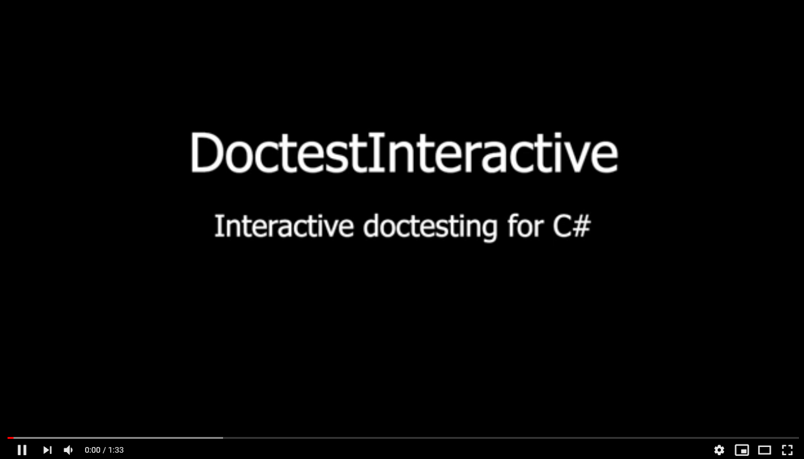
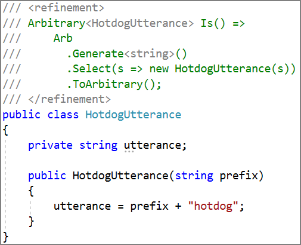
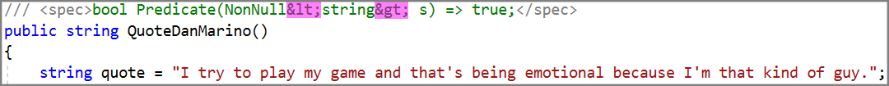

# [DoctestInteractive](https://github.com/tomakita/DoctestInteractive)

**DoctestInteractive** is a Visual Studio extension that allows you to use C# to specify correctness properties for the C# program being edited.  DoctestInteractive uses [FsCheck](https://github.com/fscheck/FsCheck) to make a best-effort attempt to verify that those properties are satisfied in real time, as you edit your code, and provides feedback when those properties are not satisfied.

**DoctestInteractive is in beta.  Please open an issue if you have a feature request or a bug report!**

# Demo Video

# How to Get It

- On the Visual Studio Marketplace as "DoctestInteractive"
- Has only been tested using Visual Studio 2017
- For use with .NET Framework 4.6.1 and up

# Usage

For a complete, runnable example, see `/examples/Superhero.cs`.

DoctestInteractive operates upon two kinds of objects: `spec`s, and `refinement`s.  

A spec is given as a C# function, and defines a correctness property of the program being edited.  One or more specs can be given for functions, properties, and constructors.  A spec must return either `FsCheck.Property` or `bool`, and must be enclosed in `<spec></spec>` tags in the corresponding function/property/constructor's XML documentation.

A refinement is given as a C# function, and tells FsCheck how to generate an arbitrary instance of the type being refined.  A refinement can only be given for a class, and must return a `FsCheck.Arbitrary<T>`, where `T` is the type being refined.  Refinements must be enclosed in `<refinement></refinement>` tags in the corresponding class's XML documentation.

Neither specs nor refinements may be given access modifiers.

Specs and refinements have access to all types in FsCheck, as well as all types which have been `using`'d into the file being edited.

DoctestInteractive is currently in beta.  If you encounter instability when using it, check the log files located in `%LocalAppData%\Microsoft\VisualStudio\<your version of VS>\Extensions\<wherever VS chose to install DoctestInteractive>`.  Feel free to open issues for bug reports, feature requests, or any other feedback!

# Limitations & Planned Improvements

- DoctestInteractive uses [property based testing](https://hypothesis.works/articles/what-is-property-based-testing/) to execute specs.  Therefore, a spec that doesn't fail does not imply that the spec is satisfied by the code being specified -- it only means that the property based testing framework being used ([FsCheck](https://github.com/fscheck/FsCheck)) was not able to find a counterexample to the spec.
- .NET Core is not yet supported.  DoctestInteractive has a dependency on AppDomain.Unload, and until similar functionality is added to .NET Core (currently scheduled for .NET Core 3.0), only .NET Framework will be supported.
- DoctestInteractive does its best to show you syntax errors made in specs and refinements:  
  
But it doesn't show you **all** kinds of errors.  Such error messaging is difficult to implement, and is an area which can be improved upon in future releases.
- To support generics and inequalities, `<` and `>` are allowed in specs and refinements.  
  
However, `<` and `>` are not legal characters in XML documents.  Therefore, specs and refinements which use these characters will break other clients of a code file's XML documentation, such as the [Sandcastle Help File Builder](https://github.com/EWSoftware/SHFB) and Visual Studio's own XML documentation parser (the thing that allows user-defined Intellisense tooltips to be shown on hover).  With this in mind, the character entity reference for each of `<` (`&lt;`) and `>` (`&gt;`) can be used in specs and refinements:  
  
- DoctestInteractive can only be used when editing code that's associated with a `.sln` file.  Furthermore, that `.sln` file must be saved whenever a new file or reference is added to any of its projects -- otherwise DoctestInteractive won't know that they exist.
- Specs can only be used to specify public methods, properties, and constructors.  Refinements can only be used to specify public classes.